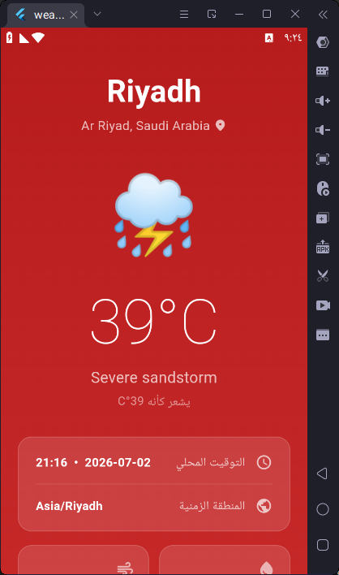
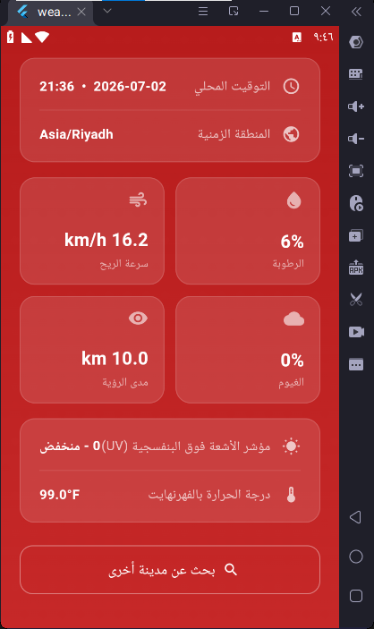
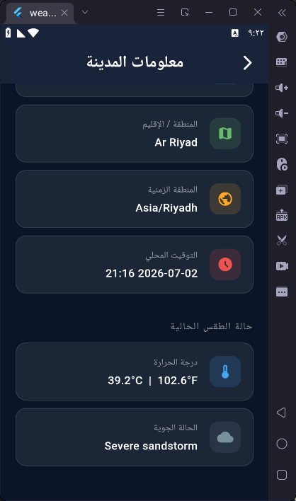

# 🌤️ Weather App — Flutter + GetX

A clean and simple Flutter Android application that fetches real-time weather data using the [WeatherAPI](https://www.weatherapi.com/) and manages state with **GetX**.

Built as a university assignment demonstrating API integration, state management, and multi-screen navigation in Flutter.

---

## 📸 Screenshots

<table align="center">
  <tr>
    <td align="center"><br><b>Search Screen</b><br>Search for any city</td>
    <td align="center"><br><b>Weather Details</b><br>Full weather breakdown</td>
    <td align="center"><br><b>Weather Details</b><br>Dynamic background & stats</td>
  </tr>
</table>

<table align="center">
  <tr>
    <td align="center"><br><b>City Info</b><br>Location & timezone</td>
    <td align="center"><br><b>City Info</b><br>Detailed coordinates</td>
  </tr>
</table>


---

## ✨ Features

- 🔍 Search weather by **city name**
- 🌡️ Current temperature in **°C and °F**
- 🕐 **Local time** of the searched city
- 🌐 **Timezone** information
- 🗺️ **Country** and **Region**
- 💧 Humidity, wind speed, visibility, UV index, cloud cover
- ⚡ Quick-access buttons for popular cities
- 🎨 Dynamic background color based on temperature
- ❌ Error handling for invalid cities or network issues

---


## 🏗️ Project Structure

```
lib/
├── main.dart                        # App entry point, routes, GetMaterialApp
├── models/
│   └── weather_model.dart           # WeatherModel data class (fromJson)
├── controllers/
│   └── weather_controller.dart      # GetX Controller — API calls & state
├── bindings/
│   └── weather_binding.dart         # GetX Binding — dependency injection
└── views/
    ├── search_screen.dart           # Screen 1: City search
    ├── details_screen.dart          # Screen 2: Weather details
    └── info_screen.dart             # Screen 3: City & timezone info
```

---

## 🔧 Tech Stack

| Technology | Purpose |
|---|---|
| **Flutter** | UI framework |
| **GetX** | State management & navigation |
| **http** | REST API calls |
| **WeatherAPI.com** | Weather data source |

---

## 🚀 Getting Started

### Prerequisites
- Flutter SDK `>=3.0.0`
- A free API key from [weatherapi.com](https://www.weatherapi.com/)

### 1. Clone the repository
```bash
git clone https://github.com/your-username/weather-app.git
cd weather-app
```

### 2. Add your API key
Open `lib/controllers/weather_controller.dart` and replace the placeholder:
```dart
static const String _apiKey = 'YOUR_API_KEY_HERE';
```

### 3. Install dependencies
```bash
flutter pub get
```

### 4. Run the app
```bash
flutter run
```

---

## 📦 Dependencies

```yaml
dependencies:
  get: ^4.6.6        # State management & routing
  http: ^1.1.0       # HTTP requests
  intl: ^0.18.1      # Date/time formatting
```

---

## 🔌 API Reference

This app uses the **WeatherAPI Current Weather** endpoint:

```
GET https://api.weatherapi.com/v1/current.json?key={API_KEY}&q={city}
```

**Data used from response:**

| Field | Description |
|---|---|
| `location.name` | City name |
| `location.country` | Country |
| `location.region` | Region / state |
| `location.tz_id` | Timezone (e.g. `Asia/Riyadh`) |
| `location.localtime` | Local date and time |
| `current.temp_c` / `temp_f` | Temperature |
| `current.condition.text` | Weather condition |
| `current.humidity` | Humidity % |
| `current.wind_kph` | Wind speed |
| `current.uv` | UV index |

---

## 🗂️ State Management with GetX

State is managed using `Rx` observables in `WeatherController`:

```dart
final Rx<WeatherModel?> weather = Rx<WeatherModel?>(null);
final RxBool isLoading = false.obs;
final RxString errorMessage = ''.obs;
```

UI reacts to state changes using `Obx`:

```dart
Obx(() => controller.isLoading.value
    ? CircularProgressIndicator()
    : Text('${controller.weather.value?.tempC}°C'))
```

Navigation between screens uses GetX named routes:

```dart
Get.toNamed('/details');
Get.toNamed('/info', arguments: weatherModel);
```

---

